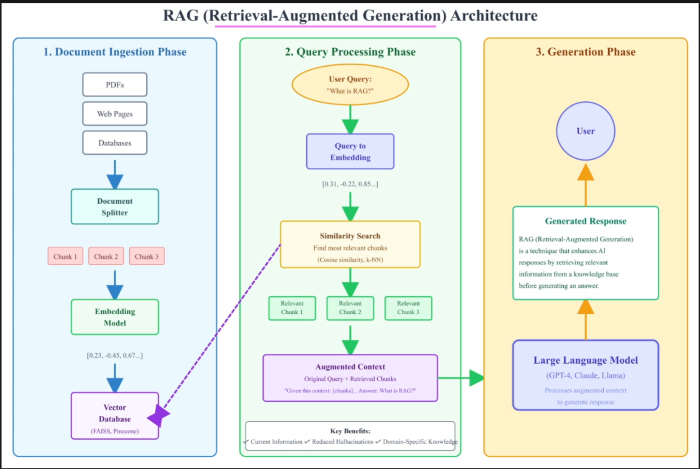

# 🚀 RAG Intro Project: Hands-On Retrieval-Augmented Generation! 😊

Welcome to your first dive into **Retrieval-Augmented Generation (RAG)**! This project is a fun, beginner-friendly guide to building a simple RAG system. Think of it as supercharging AI with real-world knowledge retrieval. Let's get started! 🎉

Architectue:

## 🤔 What is RAG?

RAG combines the power of retrieval (finding relevant info from a knowledge base) with generation (creating responses using AI models). It's like giving your chatbot a memory boost! 📚🤖

## 🛠️ Hands-On Setup

1. **Clone this repo**: `git clone https://github.com/yourusername/rag-intro.git` (replace with your repo URL 😉)
2. **Install dependencies**: Run `pip install -r requirements.txt` (we're using Python here!)
3. **Prepare your data**: Add some text files to the `data/` folder – like articles or docs.
4. **Run the script**: Execute `python rag_demo.py` to see RAG in action! It retrieves info and generates answers. 🌟

## 🎯 Example Usage

- Ask: "What is machine learning?"
- RAG retrieves from your data and responds: "Machine learning is a subset of AI that learns from data... 😄"

## 📝 Next Steps

Experiment by adding more data or tweaking the model. Happy coding! 🚀

Feel free to contribute or star this repo! ⭐
